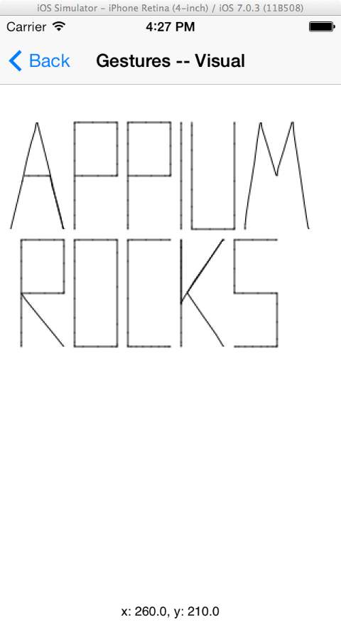

# AppiumDemo

An iOS demo project built with [RubyMotion](http://www.rubymotion.com/), to test with [Appium](http://www.appium.io).

Largely it will attempt to build gesture controls that are testable.

Allow for editing text fields and acting on inserted data, scrolling, advanced gestures involving multiple fingers. All of these will be developed with accessibility info, and in ways that create testable scenarios.

# Gestures

The following are currently supported:

* tap
* press
* longPress
* swipe

There is also a visual gesture tool, which draws gestures in order to see the precision with which Appium can handle gestures.

